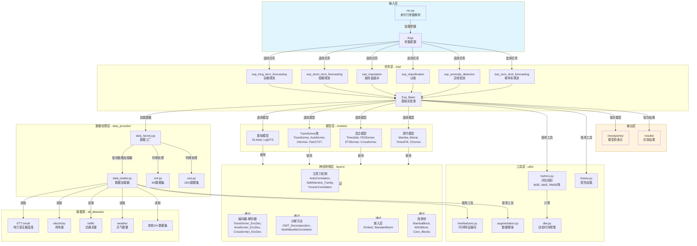

# Time-Series-Library 项目架构文档

## 📋 项目概述

**Time-Series-Library** 是一个综合性的**深度学习时间序列基准库**，支持：
- ✅ 6种主要任务类型
- ✅ 30+个SOTA模型  
- ✅ 20+个真实数据集
- ✅ 完整的数据处理管道

---

## 🏗️ 整体架构图




```
┌─────────────────┐
│   run.py        │  命令行入口 + 参数解析
│  (Input Layer)  │
└────────┬────────┘
         │
┌────────▼────────────────────────────────────────┐
│  任务层 (exp/)  - 6种时间序列任务                │
├─────────────────────────────────────────────────┤
│ • exp_long_term_forecasting  (长期预测)         │
│ • exp_short_term_forecasting (短期预测)         │
│ • exp_imputation             (缺失值插补)       │
│ • exp_classification         (分类)             │
│ • exp_anomaly_detection      (异常检测)         │
│ • exp_zero_shot_forecasting  (零样本预测)       │
│ • Exp_Basic                  (基础实验类)       │
└────────┬────────────────────────────────────────┘
         │
    ┌────┴────┬──────────┐
    │          │          │
┌───▼──┐  ┌───▼──┐  ┌───▼──┐
│数据  │  │模型  │  │工具  │
│处理  │  │层    │  │层    │
│层    │  │      │  │      │
└───┬──┘  └───┬──┘  └───┬──┘
    │         │         │
┌───▼─────────▼─────────▼──┐
│  神经网络层 (layers/)     │
│  ├─ 注意力机制           │
│  ├─ 编码器-解码器        │
│  ├─ 分解方法             │
│  └─ 嵌入与标准化         │
└───┬──────────────────────┘
    │
┌───▼───────────────────┐
│  模型输出              │
├───────────────────────┤
│ • checkpoints/        │
│ • results/            │
└───────────────────────┘
```

---

## 📌 各层详细说明

### 1️⃣ **输入层** - `run.py`
- **功能**：命令行参数解析、配置管理、随机种子固定
- **职责**：接收用户命令 → 解析参数 → 分发到任务类
- **关键参数**：task_name、model、data、features、enc_in等

### 2️⃣ **任务层** - `exp/`
所有任务继承自 `Exp_Basic` 基类，完整生命周期管理：
- **exp_long_term_forecasting.py** - 长期预测（预测未来96/192/336时步）
- **exp_short_term_forecasting.py** - 短期预测（预测未来1-24时步）
- **exp_imputation.py** - 缺失值插补（填充被掩盖的数据）
- **exp_classification.py** - 时间序列分类
- **exp_anomaly_detection.py** - 异常检测
- **exp_zero_shot_forecasting.py** - 零样本预测（无需训练）

**Exp_Basic 提供**：
```python
- _build_model()：构建模型
- _get_data()：加载数据
- train()：训练循环
- vali()：验证逻辑
- test()：测试逻辑
```

### 3️⃣ **数据处理层** - `data_provider/`

#### 核心文件：
- **data_factory.py** - 根据数据集名称与模式自动选择加载器
- **data_loader.py** - CSV解析、特征提取、标准化、滑动窗口创建
- **m4.py** - M4竞赛数据集特殊处理
- **uea.py** - UEA时间序列分类数据集处理

#### 数据处理流程示例（以ETTh1为例）：
```
原始CSV文件 (8列)
├─ date: 2016-07-01 00:00:00
└─ 7个特征: HUFL, HULL, MUFL, MULL, LUFL, LULL, OT
         ↓
   [删除date列]
         ↓
   [标准化/归一化]
         ↓
   [创建滑动窗口]
   - seq_len=96：输入序列长度
   - pred_len=96：预测长度
   - stride=1：步长
         ↓
   训练集样本:
   ├─ X: (96, 7) → 输入序列
   └─ Y: (96, 7) → 目标序列（向前偏移pred_len）
         ↓
   张量输入到模型:
   (batch_size, 96, 7)
```

#### 关键配置 - features 参数：
| 模式 | 说明 | 输入维度 | 输出维度 | 应用场景 |
|------|------|---------|---------|---------|
| **M** | Multivariate | 7 | 7 | 多变量预测多变量 (使用所有特征) |
| **S** | Univariate | 1 | 1 | 单变量预测单变量 (仅用target列) |
| **MS** | Multivariate-Single | 7 | 1 | 使用全部特征预测单个目标 |

### 4️⃣ **模型层** - `models/` (30+个模型)

#### ⚡ 基础模型 (轻量化、快速基准)
```
DLinear.py          简单线性模型
LightTS.py          轻量级时间序列模型
```

#### 🔍 Transformer系列 (注意力机制)
```
Transformer.py      标准Transformer架构
Autoformer.py       自相关分解 + Transformer
Informer.py         稀疏Transformer（处理长序列）
PatchTST.py         补丁级别Transformer
```

#### 🎯 混合/分解模型 (多种技术融合)
```
TimesNet.py         时间序列特定设计网络
FEDformer.py        频域&时域分解 + Transformer
ETSformer.py        误差-趋势-季节性分解
Crossformer.py      跨变量注意力
Nonstationary_Transformer.py  非平稳数据处理
```

#### 🚀 现代模型 (最新技术)
```
Mamba.py            状态空间模型 (S4类)
Moirai.py           大规模预训练时间序列模型
TimesFM.py          谷歌基础时间序列模型
Chronos.py          自回归概率模型
```

#### 其他热门模型：
```
FiLM.py, FreTS.py, KANAD.py, Koopa.py, 
MICN.py, MSGNet.py, SCINet.py, SegRNN.py, 
TiDE.py, TimeFilter.py, TimeMixer.py, TimeXer.py
```

### 5️⃣ **神经网络层** - `layers/`

构建单个模型的基础组件：

#### 注意力机制
- **AutoCorrelation.py** - 自相关注意力（TimesNet中使用）
- **SelfAttention_Family.py** - 多种自注意力实现
- **FourierCorrelation.py** - 傅立叶变换空间中的相关性

#### 编码器-解码器架构
- **Transformer_EncDec.py** - 标准Transformer编码解码
- **Autoformer_EncDec.py** - Autoformer专用编码解码
- **Crossformer_EncDec.py** - Crossformer专用结构
- **Pyraformer_EncDec.py** - 金字塔结构编码解码
- **ETSformer_EncDec.py** - ETSformer编码解码

#### 分解方法
- **DWT_Decomposition.py** - 离散小波分解
- **MultiWaveletCorrelation.py** - 多小波相关性

#### 其他组件
- **Embed.py** - 时间序列嵌入层
- **StandardNorm.py** - 标准化（RevIN等）
- **MambaBlock.py** - Mamba状态空间块
- **MSGBlock.py** - 多尺度特征融合块
- **Conv_Blocks.py** - 卷积块集合

### 6️⃣ **工具层** - `utils/`

#### metrics.py - 评估指标
```python
MSE     均方误差（回归标准指标）
MAE     平均绝对误差
RMSE    均方根误差
MAPE    平均绝对百分比误差（相对误差）
DTW     动态时间规整（时间序列相似度）
```

#### losses.py - 损失函数
```python
L1Loss, L2Loss      标准损失
加权损失             对不同时间步加权
```

#### timefeatures.py - 时间特征编码
```python
周期性特征    月份、星期、小时等
时序标记      假日、特殊日期标记
```

#### 其他工具
- **augmentation.py** - 数据增强（混合增强、噪声）
- **dtw.py** - DTW动态规划实现
- **masking.py** - 掩盖策略（用于插补任务）
- **m4_summary.py** - M4竞赛指标计算

---

## 📁 核心目录结构

```
Time-Series-Library/
│
├── run.py                       # 🎯 主程序入口
│
├── exp/                         # 📋 任务实现层
│   ├── exp_basic.py            # 基础实验类（核心）
│   ├── exp_long_term_forecasting.py
│   ├── exp_short_term_forecasting.py
│   ├── exp_imputation.py
│   ├── exp_classification.py
│   ├── exp_anomaly_detection.py
│   └── exp_zero_shot_forecasting.py
│
├── data_provider/               # 📊 数据加载层
│   ├── data_factory.py         # 数据工厂（路由器）
│   ├── data_loader.py          # CSV加载 + 特征提取
│   ├── m4.py                   # M4数据集
│   └── uea.py                  # UEA数据集
│
├── models/                      # 🤖 模型库 (30+模型)
│   ├── DLinear.py
│   ├── Autoformer.py
│   ├── TimesNet.py
│   ├── Mamba.py
│   └── ... (更多模型)
│
├── layers/                      # 🧱 神经网络组件
│   ├── SelfAttention_Family.py
│   ├── Transformer_EncDec.py
│   ├── DWT_Decomposition.py
│   ├── Embed.py
│   └── ... (更多层)
│
├── utils/                       # 🔧 工具函数
│   ├── metrics.py              # 评估指标
│   ├── losses.py               # 损失函数
│   ├── timefeatures.py         # 时间特征编码
│   └── ... (更多工具)
│
├── datasets/                    # 📁 数据集目录
│   └── all_datasets/           # 20+个真实数据集
│       ├── ETT-small/
│       ├── electricity/
│       ├── traffic/
│       ├── weather/
│       └── ... 
│
├── checkpoints/                 # 💾 模型检查点
│   └── [task_id_timestamp]/    # 每个任务一个目录
│
└── results/                     # 📈 实验结果
    └── [task_id_timestamp]/    # 每个任务的输出
```

---

## 💡 快速参考

### 关键参数含义表

| 参数 | 类型 | 说明 | 示例值 |
|------|------|------|--------|
| `--task_name` | str | 任务类型 | `long_term_forecast` |
| `--model` | str | 模型名称 | `DLinear`, `TimesNet`, `Mamba` |
| `--data` | str | 数据集名称 | `ETTh1`, `electricity`, `traffic` |
| `--features` | str | 预测模式 | `M`(多变量), `S`(单变量), `MS` |
| `--seq_len` | int | 输入序列长度 | `96` (过去96个时步) |
| `--label_len` | int | 标签起始位置 | `48` |
| `--pred_len` | int | 预测长度 | `96` (预测未来96个时步) |
| `--enc_in` | int | **编码器输入维度** | **`7` (仅数值特征)** |
| `--dec_in` | int | 解码器输入维度 | `7` |
| `--c_out` | int | 输出维度 | `7` |
| `--d_model` | int | 隐层维度 | `512` |
| `--n_heads` | int | 注意力头数 | `8` |
| `--e_layers` | int | 编码器层数 | `2` |
| `--d_layers` | int | 解码器层数 | `1` |
| `--d_ff` | int | FFN隐层维度 | `2048` |
| `--train_epochs` | int | 训练轮数 | `10` |
| `--batch_size` | int | 批大小 | `32` |
| `--learning_rate` | float | 学习率 | `0.0001` |

### 关于 `--enc_in 7` 的详细说明

``` 📌 **核心概念**
数据来源：ETTh1.csv 有 8 列
├─ date 列：日期时间戳 ❌ 不计入 enc_in
└─ 数值列：HUFL, HULL, MUFL, MULL, LUFL, LULL, OT ✅ = 7列

因此：
--enc_in 7   ⟹   仅包含 7 个数值特征
             ⟹   date 列已被 data_loader.py 删除
             ⟹   模型输入形状：(batch_size, seq_len=96, enc_in=7)
```

---

## 🔄 数据流处理示例

### 从命令到输出的完整流程：

```
$ python run.py --task_name long_term_forecast \
                 --model DLinear \
                 --data ETTh1 \
                 --features M \
                 --seq_len 96 --pred_len 96 \
                 --enc_in 7 --dec_in 7 --c_out 7
                 
         ↓
     run.py 解析参数
     
         ↓
     exp_long_term_forecasting 初始化
     继承 Exp_Basic
     
         ↓
     Exp_Basic._build_model()
     └─ 扫描 models/ 目录
     └─ 自动加载 DLinear.py
     └─ 创建模型实例
     
         ↓
     Exp_Basic._get_data()
     └─ data_factory.get_data()
     └─ DatasetETT 加载 ETTh1.csv
     └─ 删除 date 列
     └─ 创建 (X, Y) 样本对：
        X.shape = (N, 96, 7)
        Y.shape = (N, 96, 7)
     
         ↓
     Exp_Basic.train()
     └─ 循环 epochs
     └─ 前向传播：Y_pred = model(X)
     └─ 计算损失 & 反向传播
     └─ 更新权重
     
         ↓
     Exp_Basic.test()
     └─ 在测试集评估
     └─ 计算 MSE, MAE, DTW
     
         ↓
     保存结果
     ├─ checkpoints/long_term_forecast_xxx/
     │  └─ checkpoint.pth (模型权重)
     └─ results/long_term_forecast_xxx/
        └─ pred.npy, true.npy (预测和真实值)
```

---

## ✨ 架构亮点

### 💎 核心设计原则：
1. **模块化** - 模型/任务/数据独立，便于组合
2. **可扩展** - 添加新模型只需放在 models/ 目录
3. **自动化** - 自动扫描模型，智能路由数据
4. **生产级** - 完整的评估指标和模型保存机制
5. **研究友好** - 支持多种任务和预测模式

### 🎯 适用场景：
- ✅ 时间序列预测基准对比
- ✅ 新模型验证测试
- ✅ 数据集基准建立
- ✅ 生产模型训练部署
- ✅ 学术研究和论文复现

---

## 📚 常用命令示例

### 长期预测
```bash
python -u run.py \
  --task_name long_term_forecast \
  --is_training 1 \
  --root_path ./datasets/ETT-small/ \
  --data_path ETTh1.csv \
  --model_id ETTh1_test \
  --model DLinear \
  --data ETTh1 \
  --features M \
  --seq_len 96 --pred_len 96 \
  --enc_in 7 --dec_in 7 --c_out 7 \
  --train_epochs 10 \
  --batch_size 32 \
  --learning_rate 0.0001 \
  --num_workers 2
```

### 短期预测
```bash
python -u run.py \
  --task_name short_term_forecast \
  --is_training 1 \
  --model TimesNet \
  --data ETTh1 \
  --seq_len 96 --pred_len 24 \
  --train_epochs 10
```

### 缺失值插补
```bash
python -u run.py \
  --task_name imputation \
  --is_training 1 \
  --model Mamba \
  --data ETTh1 \
  --mask_rate 0.25 \
  --train_epochs 10
```

---

## 🔗 相关文档

- 📖 README.md - 项目总体介绍
- 🔧 run.py - 所有可用命令行参数
- 📊 data_provider/data_loader.py - 数据加载细节
- 🤖 models/ - 各个模型的具体实现

---

**更新于**: 2026年3月30日
