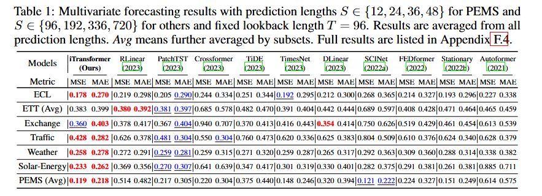
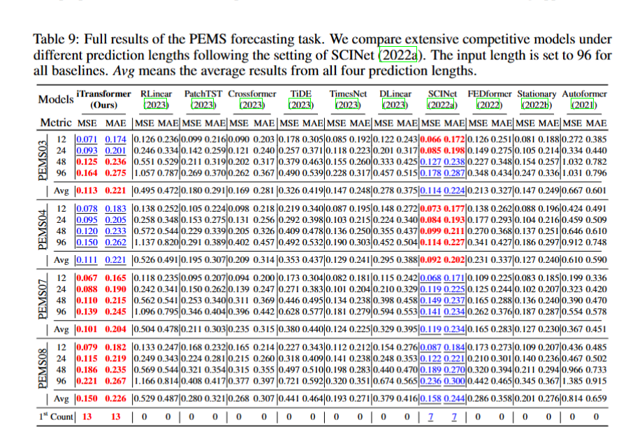
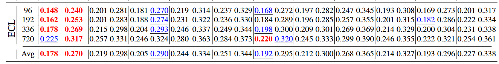

# iTransformer 表 1 复现实验文档

## 1. 复现目标与口径

目标：复现图中 iTransformer 在多变量长期预测任务上的结果。

口径要求：
- Others 数据集预测长度使用 96, 192, 336, 720。
- PEMS 数据集预测长度使用 12, 24, 36, 48。
- 固定回看窗口 seq_len=96。
- 指标使用 MSE 与 MAE。

本仓库命令入口：run.py

核心任务参数：
- --task_name long_term_forecast
- --model iTransformer
- --features M
- --seq_len 96
- --label_len 48

## 2. 运行前说明

1) 数据目录
- ETT: ./dataset/ETT-small/
- ECL: ./dataset/electricity/
- Exchange: ./dataset/exchange_rate/
- Traffic: ./dataset/traffic/
- Weather: ./dataset/weather/
- Solar: ./dataset/Solar/
- PEMS: ./dataset/PEMS/

2) 当前仓库兼容性提示
- 当前 data_provider/data_factory.py 未注册 PEMS 与 Solar 数据类型。
- 如果直接在本仓库执行 PEMS 与 Solar 命令，需要先补充对应 Dataset 类并在 data_factory 中注册。
- 本文档先给出完整复现命令，便于后续在兼容后直接运行。

3) 默认随机性
- run.py 中固定随机种子为 2021。
- 文中命令默认 itr=1，可后续多次重复取平均。

## 3. Others 组命令（96, 192, 336, 720）

### 3.1 ECL

PowerShell 示例（逐个预测长度运行）：

#### 96：
python -u run.py --task_name long_term_forecast --is_training 1 --root_path ./dataset/electricity/ --data_path electricity.csv --model_id ECL_96_96 --model iTransformer --data custom --features M --seq_len 96 --label_len 48 --pred_len 96 --e_layers 3 --d_layers 1 --factor 3 --enc_in 321 --dec_in 321 --c_out 321 --d_model 512 --d_ff 512 --batch_size 16 --learning_rate 0.0005 --des Exp --itr 1
    
long_term_forecast_ECL_96_96_iTransformer_custom_ftM_sl96_ll48_pl96_dm512_nh8_el3_dl1_df512_expand2_dc4_fc3_ebtimeF_dtTrue_Exp_0  
mse:0.1487400084733963, mae:0.2406177967786789, dtw:Not calculated

#### 192：
python -u run.py --task_name long_term_forecast --is_training 1 --root_path ./dataset/electricity/ --data_path electricity.csv --model_id ECL_96_192 --model iTransformer --data custom --features M --seq_len 96 --label_len 48 --pred_len 192 --e_layers 3 --d_layers 1 --factor 3 --enc_in 321 --dec_in 321 --c_out 321 --d_model 512 --d_ff 512 --batch_size 16 --learning_rate 0.0005 --des Exp --itr 1

#### 336：
python -u run.py --task_name long_term_forecast --is_training 1 --root_path ./dataset/electricity/ --data_path electricity.csv --model_id ECL_96_336 --model iTransformer --data custom --features M --seq_len 96 --label_len 48 --pred_len 336 --e_layers 3 --d_layers 1 --factor 3 --enc_in 321 --dec_in 321 --c_out 321 --d_model 512 --d_ff 512 --batch_size 16 --learning_rate 0.0005 --des Exp --itr 1

#### 720：
python -u run.py --task_name long_term_forecast --is_training 1 --root_path ./dataset/electricity/ --data_path electricity.csv --model_id ECL_96_720 --model iTransformer --data custom --features M --seq_len 96 --label_len 48 --pred_len 720 --e_layers 3 --d_layers 1 --factor 3 --enc_in 321 --dec_in 321 --c_out 321 --d_model 512 --d_ff 512 --batch_size 16 --learning_rate 0.0005 --des Exp --itr 1

### 3.2 Exchange

python -u run.py --task_name long_term_forecast --is_training 1 --root_path ./dataset/exchange_rate/ --data_path exchange_rate.csv --model_id Exchange_96_96 --model iTransformer --data custom --features M --seq_len 96 --label_len 48 --pred_len 96 --e_layers 2 --d_layers 1 --factor 3 --enc_in 8 --dec_in 8 --c_out 8 --d_model 128 --d_ff 128 --des Exp --itr 1

python -u run.py --task_name long_term_forecast --is_training 1 --root_path ./dataset/exchange_rate/ --data_path exchange_rate.csv --model_id Exchange_96_192 --model iTransformer --data custom --features M --seq_len 96 --label_len 48 --pred_len 192 --e_layers 2 --d_layers 1 --factor 3 --enc_in 8 --dec_in 8 --c_out 8 --d_model 128 --d_ff 128 --des Exp --itr 1

python -u run.py --task_name long_term_forecast --is_training 1 --root_path ./dataset/exchange_rate/ --data_path exchange_rate.csv --model_id Exchange_96_336 --model iTransformer --data custom --features M --seq_len 96 --label_len 48 --pred_len 336 --e_layers 2 --d_layers 1 --factor 3 --enc_in 8 --dec_in 8 --c_out 8 --d_model 128 --d_ff 128 --train_epochs 1 --des Exp --itr 1

python -u run.py --task_name long_term_forecast --is_training 1 --root_path ./dataset/exchange_rate/ --data_path exchange_rate.csv --model_id Exchange_96_720 --model iTransformer --data custom --features M --seq_len 96 --label_len 48 --pred_len 720 --e_layers 2 --d_layers 1 --factor 3 --enc_in 8 --dec_in 8 --c_out 8 --d_model 128 --d_ff 128 --des Exp --itr 1

### 3.3 Traffic

python -u run.py --task_name long_term_forecast --is_training 1 --root_path ./dataset/traffic/ --data_path traffic.csv --model_id Traffic_96_96 --model iTransformer --data custom --features M --seq_len 96 --label_len 48 --pred_len 96 --e_layers 4 --d_layers 1 --factor 3 --enc_in 862 --dec_in 862 --c_out 862 --d_model 512 --d_ff 512 --batch_size 16 --learning_rate 0.001 --des Exp --itr 1

python -u run.py --task_name long_term_forecast --is_training 1 --root_path ./dataset/traffic/ --data_path traffic.csv --model_id Traffic_96_192 --model iTransformer --data custom --features M --seq_len 96 --label_len 48 --pred_len 192 --e_layers 4 --d_layers 1 --factor 3 --enc_in 862 --dec_in 862 --c_out 862 --d_model 512 --d_ff 512 --batch_size 16 --learning_rate 0.001 --des Exp --itr 1

python -u run.py --task_name long_term_forecast --is_training 1 --root_path ./dataset/traffic/ --data_path traffic.csv --model_id Traffic_96_336 --model iTransformer --data custom --features M --seq_len 96 --label_len 48 --pred_len 336 --e_layers 4 --d_layers 1 --factor 3 --enc_in 862 --dec_in 862 --c_out 862 --d_model 512 --d_ff 512 --batch_size 16 --learning_rate 0.001 --des Exp --itr 1

python -u run.py --task_name long_term_forecast --is_training 1 --root_path ./dataset/traffic/ --data_path traffic.csv --model_id Traffic_96_720 --model iTransformer --data custom --features M --seq_len 96 --label_len 48 --pred_len 720 --e_layers 4 --d_layers 1 --factor 3 --enc_in 862 --dec_in 862 --c_out 862 --d_model 512 --d_ff 512 --batch_size 16 --learning_rate 0.001 --des Exp --itr 1

### 3.4 Weather

python -u run.py --task_name long_term_forecast --is_training 1 --root_path ./dataset/weather/ --data_path weather.csv --model_id Weather_96_96 --model iTransformer --data custom --features M --seq_len 96 --label_len 48 --pred_len 96 --e_layers 3 --d_layers 1 --factor 3 --enc_in 21 --dec_in 21 --c_out 21 --d_model 512 --d_ff 512 --des Exp --itr 1

python -u run.py --task_name long_term_forecast --is_training 1 --root_path ./dataset/weather/ --data_path weather.csv --model_id Weather_96_192 --model iTransformer --data custom --features M --seq_len 96 --label_len 48 --pred_len 192 --e_layers 3 --d_layers 1 --factor 3 --enc_in 21 --dec_in 21 --c_out 21 --d_model 512 --d_ff 512 --des Exp --itr 1

python -u run.py --task_name long_term_forecast --is_training 1 --root_path ./dataset/weather/ --data_path weather.csv --model_id Weather_96_336 --model iTransformer --data custom --features M --seq_len 96 --label_len 48 --pred_len 336 --e_layers 3 --d_layers 1 --factor 3 --enc_in 21 --dec_in 21 --c_out 21 --d_model 512 --d_ff 512 --des Exp --itr 1

python -u run.py --task_name long_term_forecast --is_training 1 --root_path ./dataset/weather/ --data_path weather.csv --model_id Weather_96_720 --model iTransformer --data custom --features M --seq_len 96 --label_len 48 --pred_len 720 --e_layers 3 --d_layers 1 --factor 3 --enc_in 21 --dec_in 21 --c_out 21 --d_model 512 --d_ff 512 --des Exp --itr 1

### 3.5 ETT 四子集（用于 ETT Avg）

ETTh1（96/192 用 256，336/720 用 512）：

python -u run.py --task_name long_term_forecast --is_training 1 --root_path ./dataset/ETT-small/ --data_path ETTh1.csv --model_id ETTh1_96_96 --model iTransformer --data ETTh1 --features M --seq_len 96 --label_len 48 --pred_len 96 --e_layers 2 --d_layers 1 --factor 3 --enc_in 7 --dec_in 7 --c_out 7 --d_model 256 --d_ff 256 --des Exp --itr 1

python -u run.py --task_name long_term_forecast --is_training 1 --root_path ./dataset/ETT-small/ --data_path ETTh1.csv --model_id ETTh1_96_192 --model iTransformer --data ETTh1 --features M --seq_len 96 --label_len 48 --pred_len 192 --e_layers 2 --d_layers 1 --factor 3 --enc_in 7 --dec_in 7 --c_out 7 --d_model 256 --d_ff 256 --des Exp --itr 1

python -u run.py --task_name long_term_forecast --is_training 1 --root_path ./dataset/ETT-small/ --data_path ETTh1.csv --model_id ETTh1_96_336 --model iTransformer --data ETTh1 --features M --seq_len 96 --label_len 48 --pred_len 336 --e_layers 2 --d_layers 1 --factor 3 --enc_in 7 --dec_in 7 --c_out 7 --d_model 512 --d_ff 512 --des Exp --itr 1

python -u run.py --task_name long_term_forecast --is_training 1 --root_path ./dataset/ETT-small/ --data_path ETTh1.csv --model_id ETTh1_96_720 --model iTransformer --data ETTh1 --features M --seq_len 96 --label_len 48 --pred_len 720 --e_layers 2 --d_layers 1 --factor 3 --enc_in 7 --dec_in 7 --c_out 7 --d_model 512 --d_ff 512 --des Exp --itr 1

ETTh2（四个长度统一 128）：

python -u run.py --task_name long_term_forecast --is_training 1 --root_path ./dataset/ETT-small/ --data_path ETTh2.csv --model_id ETTh2_96_96 --model iTransformer --data ETTh2 --features M --seq_len 96 --label_len 48 --pred_len 96 --e_layers 2 --d_layers 1 --factor 3 --enc_in 7 --dec_in 7 --c_out 7 --d_model 128 --d_ff 128 --des Exp --itr 1

python -u run.py --task_name long_term_forecast --is_training 1 --root_path ./dataset/ETT-small/ --data_path ETTh2.csv --model_id ETTh2_96_192 --model iTransformer --data ETTh2 --features M --seq_len 96 --label_len 48 --pred_len 192 --e_layers 2 --d_layers 1 --factor 3 --enc_in 7 --dec_in 7 --c_out 7 --d_model 128 --d_ff 128 --des Exp --itr 1

python -u run.py --task_name long_term_forecast --is_training 1 --root_path ./dataset/ETT-small/ --data_path ETTh2.csv --model_id ETTh2_96_336 --model iTransformer --data ETTh2 --features M --seq_len 96 --label_len 48 --pred_len 336 --e_layers 2 --d_layers 1 --factor 3 --enc_in 7 --dec_in 7 --c_out 7 --d_model 128 --d_ff 128 --des Exp --itr 1

python -u run.py --task_name long_term_forecast --is_training 1 --root_path ./dataset/ETT-small/ --data_path ETTh2.csv --model_id ETTh2_96_720 --model iTransformer --data ETTh2 --features M --seq_len 96 --label_len 48 --pred_len 720 --e_layers 2 --d_layers 1 --factor 3 --enc_in 7 --dec_in 7 --c_out 7 --d_model 128 --d_ff 128 --des Exp --itr 1

ETTm1（四个长度统一 128）：

python -u run.py --task_name long_term_forecast --is_training 1 --root_path ./dataset/ETT-small/ --data_path ETTm1.csv --model_id ETTm1_96_96 --model iTransformer --data ETTm1 --features M --seq_len 96 --label_len 48 --pred_len 96 --e_layers 2 --d_layers 1 --factor 3 --enc_in 7 --dec_in 7 --c_out 7 --d_model 128 --d_ff 128 --des Exp --itr 1

python -u run.py --task_name long_term_forecast --is_training 1 --root_path ./dataset/ETT-small/ --data_path ETTm1.csv --model_id ETTm1_96_192 --model iTransformer --data ETTm1 --features M --seq_len 96 --label_len 48 --pred_len 192 --e_layers 2 --d_layers 1 --factor 3 --enc_in 7 --dec_in 7 --c_out 7 --d_model 128 --d_ff 128 --des Exp --itr 1

python -u run.py --task_name long_term_forecast --is_training 1 --root_path ./dataset/ETT-small/ --data_path ETTm1.csv --model_id ETTm1_96_336 --model iTransformer --data ETTm1 --features M --seq_len 96 --label_len 48 --pred_len 336 --e_layers 2 --d_layers 1 --factor 3 --enc_in 7 --dec_in 7 --c_out 7 --d_model 128 --d_ff 128 --des Exp --itr 1

python -u run.py --task_name long_term_forecast --is_training 1 --root_path ./dataset/ETT-small/ --data_path ETTm1.csv --model_id ETTm1_96_720 --model iTransformer --data ETTm1 --features M --seq_len 96 --label_len 48 --pred_len 720 --e_layers 2 --d_layers 1 --factor 3 --enc_in 7 --dec_in 7 --c_out 7 --d_model 128 --d_ff 128 --des Exp --itr 1

ETTm2（四个长度统一 128）：

python -u run.py --task_name long_term_forecast --is_training 1 --root_path ./dataset/ETT-small/ --data_path ETTm2.csv --model_id ETTm2_96_96 --model iTransformer --data ETTm2 --features M --seq_len 96 --label_len 48 --pred_len 96 --e_layers 2 --d_layers 1 --factor 3 --enc_in 7 --dec_in 7 --c_out 7 --d_model 128 --d_ff 128 --des Exp --itr 1

python -u run.py --task_name long_term_forecast --is_training 1 --root_path ./dataset/ETT-small/ --data_path ETTm2.csv --model_id ETTm2_96_192 --model iTransformer --data ETTm2 --features M --seq_len 96 --label_len 48 --pred_len 192 --e_layers 2 --d_layers 1 --factor 3 --enc_in 7 --dec_in 7 --c_out 7 --d_model 128 --d_ff 128 --des Exp --itr 1

python -u run.py --task_name long_term_forecast --is_training 1 --root_path ./dataset/ETT-small/ --data_path ETTm2.csv --model_id ETTm2_96_336 --model iTransformer --data ETTm2 --features M --seq_len 96 --label_len 48 --pred_len 336 --e_layers 2 --d_layers 1 --factor 3 --enc_in 7 --dec_in 7 --c_out 7 --d_model 128 --d_ff 128 --des Exp --itr 1

python -u run.py --task_name long_term_forecast --is_training 1 --root_path ./dataset/ETT-small/ --data_path ETTm2.csv --model_id ETTm2_96_720 --model iTransformer --data ETTm2 --features M --seq_len 96 --label_len 48 --pred_len 720 --e_layers 2 --d_layers 1 --factor 3 --enc_in 7 --dec_in 7 --c_out 7 --d_model 128 --d_ff 128 --des Exp --itr 1

### 3.6 Solar

说明：本仓库若未补充 Solar loader，此部分先保留为目标命令。

python -u run.py --task_name long_term_forecast --is_training 1 --root_path ./dataset/Solar/ --data_path solar_AL.txt --model_id Solar_96_96 --model iTransformer --data Solar --features M --seq_len 96 --label_len 48 --pred_len 96 --e_layers 2 --d_layers 1 --factor 3 --enc_in 137 --dec_in 137 --c_out 137 --d_model 512 --d_ff 512 --learning_rate 0.0005 --des Exp --itr 1

python -u run.py --task_name long_term_forecast --is_training 1 --root_path ./dataset/Solar/ --data_path solar_AL.txt --model_id Solar_96_192 --model iTransformer --data Solar --features M --seq_len 96 --label_len 48 --pred_len 192 --e_layers 2 --d_layers 1 --factor 3 --enc_in 137 --dec_in 137 --c_out 137 --d_model 512 --d_ff 512 --learning_rate 0.0005 --des Exp --itr 1

python -u run.py --task_name long_term_forecast --is_training 1 --root_path ./dataset/Solar/ --data_path solar_AL.txt --model_id Solar_96_336 --model iTransformer --data Solar --features M --seq_len 96 --label_len 48 --pred_len 336 --e_layers 2 --d_layers 1 --factor 3 --enc_in 137 --dec_in 137 --c_out 137 --d_model 512 --d_ff 512 --learning_rate 0.0005 --des Exp --itr 1

python -u run.py --task_name long_term_forecast --is_training 1 --root_path ./dataset/Solar/ --data_path solar_AL.txt --model_id Solar_96_720 --model iTransformer --data Solar --features M --seq_len 96 --label_len 48 --pred_len 720 --e_layers 2 --d_layers 1 --factor 3 --enc_in 137 --dec_in 137 --c_out 137 --d_model 512 --d_ff 512 --learning_rate 0.0005 --des Exp --itr 1

## 4. PEMS 组命令（12, 24, 36, 48）

说明：本文采用统一口径 use_norm=0。

### 4.1 PEMS03

python -u run.py --task_name long_term_forecast --is_training 1 --root_path ./dataset/PEMS/ --data_path PEMS03.npz --model_id PEMS03_96_12 --model iTransformer --data PEMS --features M --seq_len 96 --label_len 48 --pred_len 12 --e_layers 4 --d_layers 1 --factor 3 --enc_in 358 --dec_in 358 --c_out 358 --d_model 512 --d_ff 512 --batch_size 32 --learning_rate 0.001 --use_norm 0 --des Exp --itr 1

python -u run.py --task_name long_term_forecast --is_training 1 --root_path ./dataset/PEMS/ --data_path PEMS03.npz --model_id PEMS03_96_24 --model iTransformer --data PEMS --features M --seq_len 96 --label_len 48 --pred_len 24 --e_layers 4 --d_layers 1 --factor 3 --enc_in 358 --dec_in 358 --c_out 358 --d_model 512 --d_ff 512 --batch_size 32 --learning_rate 0.001 --use_norm 0 --des Exp --itr 1

python -u run.py --task_name long_term_forecast --is_training 1 --root_path ./dataset/PEMS/ --data_path PEMS03.npz --model_id PEMS03_96_36 --model iTransformer --data PEMS --features M --seq_len 96 --label_len 48 --pred_len 36 --e_layers 4 --d_layers 1 --factor 3 --enc_in 358 --dec_in 358 --c_out 358 --d_model 512 --d_ff 512 --batch_size 32 --learning_rate 0.001 --use_norm 0 --des Exp --itr 1

python -u run.py --task_name long_term_forecast --is_training 1 --root_path ./dataset/PEMS/ --data_path PEMS03.npz --model_id PEMS03_96_48 --model iTransformer --data PEMS --features M --seq_len 96 --label_len 48 --pred_len 48 --e_layers 4 --d_layers 1 --factor 3 --enc_in 358 --dec_in 358 --c_out 358 --d_model 512 --d_ff 512 --batch_size 32 --learning_rate 0.001 --use_norm 0 --des Exp --itr 1

### 4.2 PEMS04

python -u run.py --task_name long_term_forecast --is_training 1 --root_path ./dataset/PEMS/ --data_path PEMS04.npz --model_id PEMS04_96_12 --model iTransformer --data PEMS --features M --seq_len 96 --label_len 48 --pred_len 12 --e_layers 4 --d_layers 1 --factor 3 --enc_in 307 --dec_in 307 --c_out 307 --d_model 1024 --d_ff 1024 --batch_size 32 --learning_rate 0.0005 --use_norm 0 --des Exp --itr 1

python -u run.py --task_name long_term_forecast --is_training 1 --root_path ./dataset/PEMS/ --data_path PEMS04.npz --model_id PEMS04_96_24 --model iTransformer --data PEMS --features M --seq_len 96 --label_len 48 --pred_len 24 --e_layers 4 --d_layers 1 --factor 3 --enc_in 307 --dec_in 307 --c_out 307 --d_model 1024 --d_ff 1024 --batch_size 32 --learning_rate 0.0005 --use_norm 0 --des Exp --itr 1

python -u run.py --task_name long_term_forecast --is_training 1 --root_path ./dataset/PEMS/ --data_path PEMS04.npz --model_id PEMS04_96_36 --model iTransformer --data PEMS --features M --seq_len 96 --label_len 48 --pred_len 36 --e_layers 4 --d_layers 1 --factor 3 --enc_in 307 --dec_in 307 --c_out 307 --d_model 1024 --d_ff 1024 --batch_size 32 --learning_rate 0.0005 --use_norm 0 --des Exp --itr 1

python -u run.py --task_name long_term_forecast --is_training 1 --root_path ./dataset/PEMS/ --data_path PEMS04.npz --model_id PEMS04_96_48 --model iTransformer --data PEMS --features M --seq_len 96 --label_len 48 --pred_len 48 --e_layers 4 --d_layers 1 --factor 3 --enc_in 307 --dec_in 307 --c_out 307 --d_model 1024 --d_ff 1024 --batch_size 32 --learning_rate 0.0005 --use_norm 0 --des Exp --itr 1

### 4.3 PEMS07

python -u run.py --task_name long_term_forecast --is_training 1 --root_path ./dataset/PEMS/ --data_path PEMS07.npz --model_id PEMS07_96_12 --model iTransformer --data PEMS --features M --seq_len 96 --label_len 48 --pred_len 12 --e_layers 4 --d_layers 1 --factor 3 --enc_in 883 --dec_in 883 --c_out 883 --d_model 512 --d_ff 512 --batch_size 16 --learning_rate 0.001 --use_norm 0 --des Exp --itr 1

python -u run.py --task_name long_term_forecast --is_training 1 --root_path ./dataset/PEMS/ --data_path PEMS07.npz --model_id PEMS07_96_24 --model iTransformer --data PEMS --features M --seq_len 96 --label_len 48 --pred_len 24 --e_layers 4 --d_layers 1 --factor 3 --enc_in 883 --dec_in 883 --c_out 883 --d_model 512 --d_ff 512 --batch_size 16 --learning_rate 0.001 --use_norm 0 --des Exp --itr 1

python -u run.py --task_name long_term_forecast --is_training 1 --root_path ./dataset/PEMS/ --data_path PEMS07.npz --model_id PEMS07_96_36 --model iTransformer --data PEMS --features M --seq_len 96 --label_len 48 --pred_len 36 --e_layers 4 --d_layers 1 --factor 3 --enc_in 883 --dec_in 883 --c_out 883 --d_model 512 --d_ff 512 --batch_size 16 --learning_rate 0.001 --use_norm 0 --des Exp --itr 1

python -u run.py --task_name long_term_forecast --is_training 1 --root_path ./dataset/PEMS/ --data_path PEMS07.npz --model_id PEMS07_96_48 --model iTransformer --data PEMS --features M --seq_len 96 --label_len 48 --pred_len 48 --e_layers 4 --d_layers 1 --factor 3 --enc_in 883 --dec_in 883 --c_out 883 --d_model 512 --d_ff 512 --batch_size 16 --learning_rate 0.001 --use_norm 0 --des Exp --itr 1

### 4.4 PEMS08

python -u run.py --task_name long_term_forecast --is_training 1 --root_path ./dataset/PEMS/ --data_path PEMS08.npz --model_id PEMS08_96_12 --model iTransformer --data PEMS --features M --seq_len 96 --label_len 48 --pred_len 12 --e_layers 4 --d_layers 1 --factor 3 --enc_in 170 --dec_in 170 --c_out 170 --d_model 512 --d_ff 512 --batch_size 16 --learning_rate 0.001 --use_norm 0 --des Exp --itr 1

python -u run.py --task_name long_term_forecast --is_training 1 --root_path ./dataset/PEMS/ --data_path PEMS08.npz --model_id PEMS08_96_24 --model iTransformer --data PEMS --features M --seq_len 96 --label_len 48 --pred_len 24 --e_layers 4 --d_layers 1 --factor 3 --enc_in 170 --dec_in 170 --c_out 170 --d_model 512 --d_ff 512 --batch_size 16 --learning_rate 0.001 --use_norm 0 --des Exp --itr 1

python -u run.py --task_name long_term_forecast --is_training 1 --root_path ./dataset/PEMS/ --data_path PEMS08.npz --model_id PEMS08_96_36 --model iTransformer --data PEMS --features M --seq_len 96 --label_len 48 --pred_len 36 --e_layers 4 --d_layers 1 --factor 3 --enc_in 170 --dec_in 170 --c_out 170 --d_model 512 --d_ff 512 --batch_size 16 --learning_rate 0.001 --use_norm 0 --des Exp --itr 1

python -u run.py --task_name long_term_forecast --is_training 1 --root_path ./dataset/PEMS/ --data_path PEMS08.npz --model_id PEMS08_96_48 --model iTransformer --data PEMS --features M --seq_len 96 --label_len 48 --pred_len 48 --e_layers 4 --d_layers 1 --factor 3 --enc_in 170 --dec_in 170 --c_out 170 --d_model 512 --d_ff 512 --batch_size 16 --learning_rate 0.001 --use_norm 0 --des Exp --itr 1

## 5. 结果文件与汇总

每条命令执行后，结果默认落在：
- results/对应实验setting目录/metrics.npy

metrics.npy 顺序：
- [mae, mse, rmse, mape, mspe]

表格汇总建议：
1) 单数据集：提取四个预测长度对应 mse, mae。
2) ETT Avg：对 ETTh1, ETTh2, ETTm1, ETTm2 先按同一预测长度做平均。
3) PEMS Avg：对 PEMS03, PEMS04, PEMS07, PEMS08 先按同一预测长度做平均。
4) 如果要与图中 Avg 列完全对齐，再对多个预测长度做一次平均。

## 6. 最小可验证子集（不跑全量时）

建议先跑：
- Others: ECL 的 96,192,336,720 四条。
- PEMS: PEMS03 的 12,24,36,48 四条。

确认流程正确后，再扩展到全量命令。

